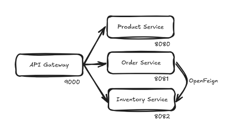
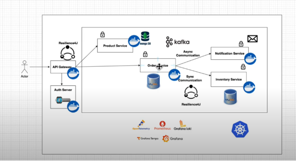
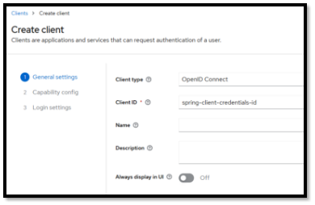
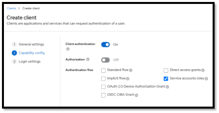
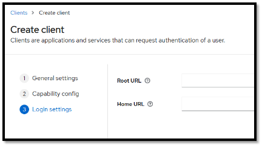
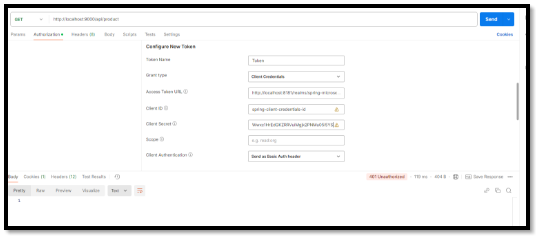
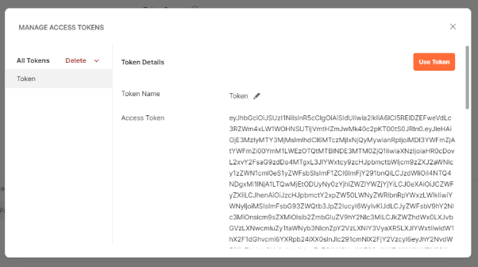
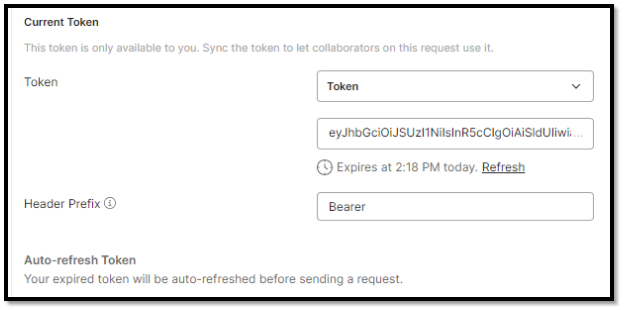
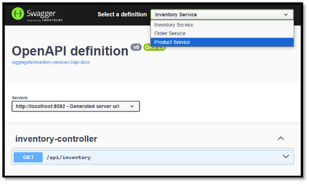
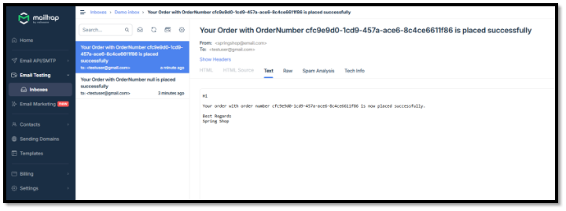

**Microservices**

**OpenFeignClient**

Communication between services – OrderService and InventoryService

@FeignClient(value = "inventory", url = "http://localhost:8082")
public interface InventoryClient {

`    `@RequestMapping(method = RequestMethod.*GET*, value = "/api/inventory")
`    `boolean isInStock(@RequestParam String skuCode, @RequestParam Integer quantity);
}

Now in order to use this, we can directly inject this into our @Service class and use the methods in here.

Here the methods in the open feign client class are similar to the methods in the JpaRepository where data JPA takes care of the underlying implementation, similarly here also openfeign takes care of the underlying implementation which is nothing but fetching the actual implementation of the method from the referenced microservice (inventory service).

**Api-Gateway**

Gateway dependency

Create a Routes configuration class :

@Configuration
public class Routes {

`    `@Value("${product.service.url}")
`    `private String productServiceUrl;
`    `@Value("${order.service.url}")
`    `private String orderServiceUrl;
`    `@Value("${inventory.service.url}")
`    `private String inventoryServiceUrl;

`    `@Bean
`    `public RouterFunction<ServerResponse> productServiceRoute() {
`        `return GatewayRouterFunctions.*route*("product\_service")
.route(RequestPredicates.*path*("/api/product"), HandlerFunctions.*http*(productServiceUrl))
.build();
`    `}

`    `@Bean
`    `public RouterFunction<ServerResponse> orderServiceRoute() {
`        `return GatewayRouterFunctions.*route*("order\_service")
.route(RequestPredicates.*path*("/api/order"), HandlerFunctions.*http*(orderServiceUrl))
.build();
`    `}

`    `@Bean
`    `public RouterFunction<ServerResponse> inventoryServiceRoute() {
`        `return GatewayRouterFunctions.*route*("inventory\_service")
.route(RequestPredicates.*path*("/api/inventory"), HandlerFunctions.*http*(inventoryServiceUrl))
.build();
`    `}

}

**Keycloak**

First of all needs two containers, one is the keycloak itself and the other is the keycloak sql, means a mysql to maintain all the clients and realms.

1. Create a realm
1. Create a client.

   

1. Leave this as it is.

     

We can get our necessary things from **openid-configuration** :

And add this to application.properties of api-gateway service :

spring.security.oauth2.resourceserver.jwt.issuer-uri=http://localhost:8181/realms/spring-microservices-security-realm

Now we access an endpoint through the api-gateway :

We will get :

When we click on ‘Use Token’, the token will be automatically added as a bearer token.

**Swagger for Documentation**

OpenAPI Specification – Swagger – provides tools and libraries

springdoc-openapi

<https://springdoc.org/#getting-started>

2 dependencies to be added – webmvc openapi and ui

springdoc.swagger-ui.path=/swagger-ui.html

**Aggregating swagger routes in api-gateway :**

1st step :

Add these to application.properties of api-gateway :

#Swagger
springdoc.swagger-ui.path=/swagger-ui.html
springdoc.api-docs.path=/api-docs
springdoc.swagger-ui.urls[0].name=Product Service
springdoc.swagger-ui.urls[0].url=/aggregate/product-service/v3/api-docs
springdoc.swagger-ui.urls[1].name=Order Service
springdoc.swagger-ui.urls[1].url=/aggregate/order-service/v3/api-docs
springdoc.swagger-ui.urls[2].name=Inventory Service
springdoc.swagger-ui.urls[2].url=/aggregate/inventory-service/v3/api-docs

Add these to Routes class :

@Bean
public RouterFunction<ServerResponse> productServiceSwaggerRoute(){
`    `return GatewayRouterFunctions.*route*("product\_service\_swagger")
.route(RequestPredicates.*path*("/aggregate/product-service/v3/api-docs"), HandlerFunctions.*http*(productServiceUrl))
.filter(*setPath*("/api-docs"))
.build();
}

@Bean
public RouterFunction<ServerResponse> orderServiceSwaggerRoute(){
`    `return GatewayRouterFunctions.*route*("order\_service\_swagger")
.route(RequestPredicates.*path*("/aggregate/order-service/v3/api-docs"), HandlerFunctions.*http*(orderServiceUrl))
.filter(*setPath*("/api-docs"))
.build();
}

@Bean
public RouterFunction<ServerResponse> inventoryServiceSwaggerRoute(){
`    `return GatewayRouterFunctions.*route*("inventory\_service\_swagger")
.route(RequestPredicates.*path*("/aggregate/inventory-service/v3/api-docs"), HandlerFunctions.*http*(inventoryServiceUrl))
.filter(*setPath*("/api-docs"))
.build();
}

We have also given all permissions for swagger related urls in our SecurityConfig, so now we can access the swagger from the api-gateway

<http://localhost:9000/swagger.ui/index.html>

**OpenFeign client to RestClient migration:**

public interface InventoryClient {

`    `@GetExchange("/api/inventory")
`    `boolean isInStock(@RequestParam String skuCode, @RequestParam Integer quantity);
}

Adding a RestClientConfig :

@Configuration
public class RestClientConfig {

`    `@Value("${inventory.service.url}")
`    `private String inventoryServiceUrl;

`    `@Bean
`    `public InventoryClient inventoryClient() {
`        `RestClient restClient = RestClient.*builder*()
.baseUrl(inventoryServiceUrl)
.build();
`        `var restClientAdapter = RestClientAdapter.*create*(restClient);
`        `var httpServiceProxyFactory = HttpServiceProxyFactory.*builderFor*(restClientAdapter).build();
`        `return httpServiceProxyFactory.createClient(InventoryClient.class);
`    `}

}

**Some refactoring :**

Remove the EnableFeignClient annotation from the root class of order microservice

Remove the dependency from pom.xml

**Circuit Breaker**

Circuit breaker follows a principle similar to the circuit system in our homes.

We use Resilience4j for this which is a light-weight fault tolerance model.

We need 2 dependencies for this :

1. Circuit-breaker resilience4j
1. Actuator 

Actuator is used because resilience relies on the actuator endpoints mostly the health endpoint for useful insights on the implemented circuit breaker.

**Important :**

The properties related to actuator and resilience which we define in application.properties are very important, because a lot of things, mostly numbers, are configured here :

*# Actuator Endpoints*

management.health.circuitbreakers.enabled=true

management.endpoints.web.exposure.include=\*

management.endpoint.health.show-details=always

*#Resilinece4j Properties*

resilience4j.circuitbreaker.configs.default.registerHealthIndicator=true

resilience4j.circuitbreaker.configs.default.slidingWindowType=COUNT\_BASED

resilience4j.circuitbreaker.configs.default.slidingWindowSize=10

resilience4j.circuitbreaker.configs.default.failureRateThreshold=50

resilience4j.circuitbreaker.configs.default.waitDurationInOpenState=5s

resilience4j.circuitbreaker.configs.default.permittedNumberOfCallsInHalfOpenState=3

resilience4j.circuitbreaker.configs.default.automaticTransitionFromOpenToHalfOpenEnabled=true

resilience4j.circuitbreaker.configs.default.minimum-number-of-calls=5

*#Resilience4J Timeout Properties*

resilience4j.timelimiter.configs.default.timeout-duration=3s

*#Resilience4J Retry Properties*

resilience4j.retry.configs.default.max-attempts=3

resilience4j.retry.configs.default.wait-duration=2s

**Different states of circuit-breaker :**

**Next we add a fallback route, holding the logic to handle a circuit broken situation :**

@Bean

public RouterFunction<ServerResponse> fallbackRoute() {

`        `return route("fallbackRoute")

.GET("/fallbackRoute", request -> ServerResponse.status(HttpStatus.SERVICE\_UNAVAILABLE)

.body("Service Unavailable, please try again later"))

.build();

`    `}

**Next we add circuit breaker as a filter to the present routes in api-gateway:**

.filter(CircuitBreakerFilterFunctions.circuitBreaker("productServiceCircuitBreaker",

`                        `URI.create("forward:/fallbackRoute")))

**Testing :**

"circuitBreakers": {

`            `"status": "UP",

`            `"details": {

`                `"productServiceCircuitBreaker": {

`                    `"status": "UP",

`                    `"details": {

`                        `"failureRate": "-1.0%",

`                        `"failureRateThreshold": "50.0%",

`                        `"slowCallRate": "-1.0%",

`                        `"slowCallRateThreshold": "100.0%",

`                        `"bufferedCalls": 2,

`                        `"slowCalls": 0,

`                        `"slowFailedCalls": 0,

`                        `"failedCalls": 1,

`                        `"notPermittedCalls": 0,

`                        `"state": "CLOSED"

`                    `}

`                `}

`            `}

`        `},

**After 5 failed requests :**

"circuitBreakers": {

`            `"status": "UNKNOWN",

`            `"details": {

`                `"productServiceCircuitBreaker": {

`                    `"status": "CIRCUIT\_HALF\_OPEN",

`                    `"details": {

`                        `"failureRate": "-1.0%",

`                        `"failureRateThreshold": "50.0%",

`                        `"slowCallRate": "-1.0%",

`                        `"slowCallRateThreshold": "100.0%",

`                        `"bufferedCalls": 0,

`                        `"slowCalls": 0,

`                        `"slowFailedCalls": 0,

`                        `"failedCalls": 0,

`                        `"notPermittedCalls": 0,

`                        `"state": "HALF\_OPEN"

`                    `}

`                `}

`            `}

`        `},

Now again when ProductService is up and running, after 3 successful requests, state will go back to CLOSED state.

Next since we have a connection between OrderService and InventoryService, therefore we need to apply circuit-breaker here :

So, we add the similar properties to application.properties here as well, but with a slight change, which is :

resilience4j.circuitbreaker.instances.inventory.event-consumer-buffer-size=10

This inventory is the name given to the InventoryClient defined in this service :

public interface InventoryClient {

`    `Logger *log* = LoggerFactory.*getLogger*(InventoryClient.class);

`    `@GetExchange("/api/inventory")
`    `**@CircuitBreaker(name = "inventory", fallbackMethod = "fallbackMethod")
`    `@Retry(name = "inventory")**
`    `boolean isInStock(@RequestParam String skuCode, @RequestParam Integer quantity);

`    `**default boolean fallbackMethod(String code, Integer quantity, Throwable throwable) {
`        `*log*.info("Cannot get inventory for skucode {}, failure reason: {}", code, throwable.getMessage());
`        `return false;
`    `}**
}

Here we are defining a fallback method, the fallback logic can be improved though.

Also, we are adding a **timelimiter** by making a few additions to the RestClientConfig :

@Bean
public InventoryClient inventoryClient() {
`    `RestClient restClient = RestClient.*builder*()
.baseUrl(inventoryServiceUrl)
.requestFactory(getClientRequestFactory())
.build();
`    `var restClientAdapter = RestClientAdapter.*create*(restClient);
`    `var httpServiceProxyFactory = HttpServiceProxyFactory.*builderFor*(restClientAdapter).build();
`    `return httpServiceProxyFactory.createClient(InventoryClient.class);
}

private ClientHttpRequestFactory getClientRequestFactory() {
`    `ClientHttpRequestFactorySettings clientHttpRequestFactorySettings = 

`		`ClientHttpRequestFactorySettings.*DEFAULTS*
.withConnectTimeout(Duration.*ofSeconds*(3))
.withReadTimeout(Duration.*ofSeconds*(3));
`    `return ClientHttpRequestFactories.*get*(clientHttpRequestFactorySettings);
}

H

spring.kafka.consumer.value-deserializer=org.springframework.kafka.support.serializer.JsonDeserializer

This is how we receive mails.

h

h

h

h
